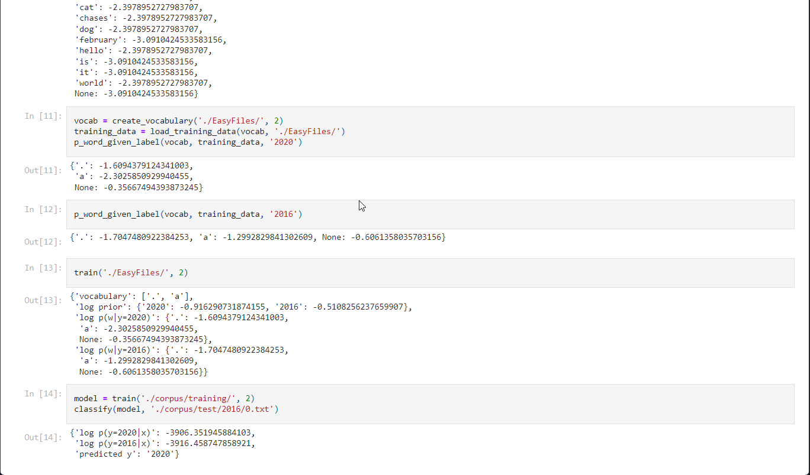
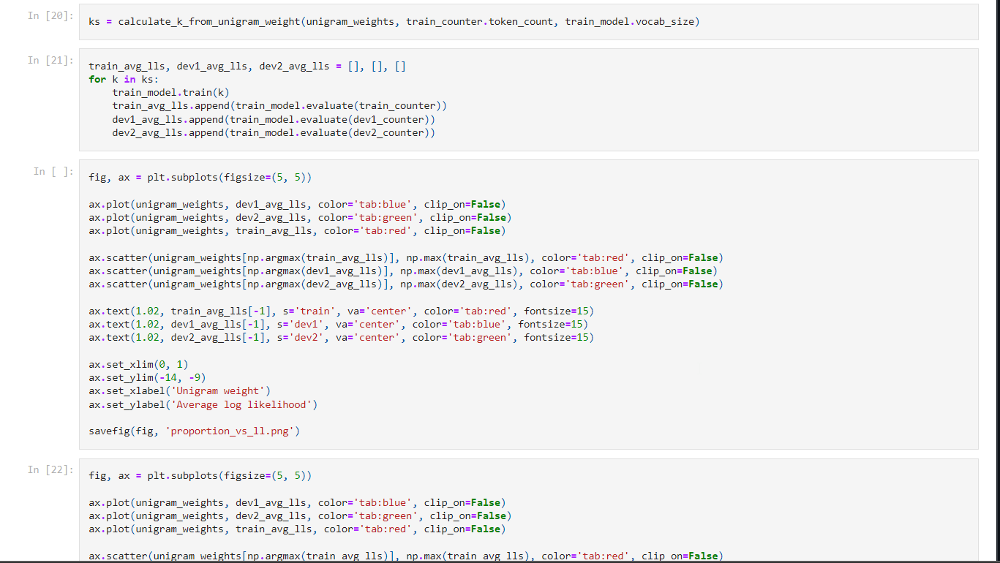
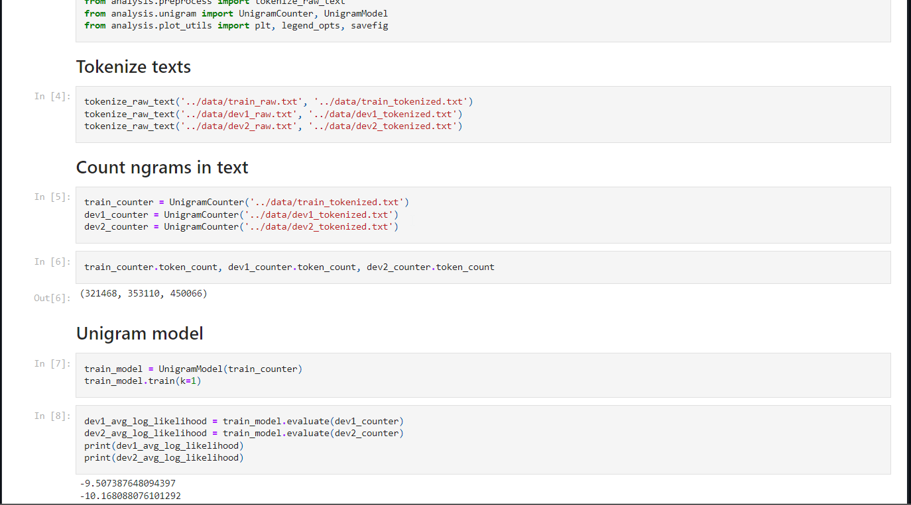

## NLP Document Classifier using Ngram Model 

# Ngram based model to estimate/predict class conditional log probability of word labels in a given corpus

1. Load Training Data from Corpus of Given Text Files 
2. Preprocess/Tokenize Raw Text File 
3. Create vocabulary from training directory 
4. Estimate class conditional log probability for known ngrams 
5. Implement Laplace Smoothing to estimate unknown Ngrams
6. Train processed test data using training set vocabulary 

